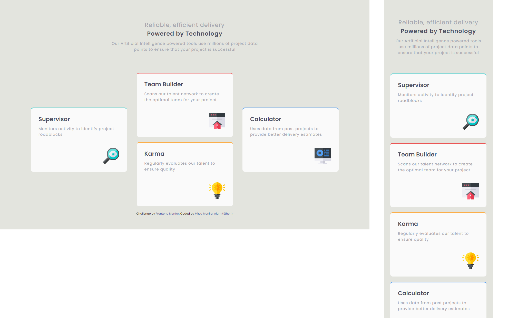

# Four Card Feature Section Solution

This is a solution to the [Four card feature section challenge on Frontend Mentor](https://www.frontendmentor.io/challenges/four-card-feature-section-weK1eFYK). 
- Creation Date: 5 April 2022

## Table of contents

- [Screenshot](#screenshot)
- [Links](#links)
- [Author](#author)
- [Date](#date)

## Screenshot

## Links

- Solution URL: [Solution](https://www.frontendmentor.io/solutions/four-card-feature-with-sassscss-rJYMvU5Qq)
- Live Site URL: [Live](https://ethenpage.github.io/Four-Card-Feature-Section/)

## Author

- Name: Mirza Monirul Alam (Ethen)
- Frontend Mentor - [@EthenPage](https://www.frontendmentor.io/profile/ethenpage)

## Date

- 5 April 2022.
